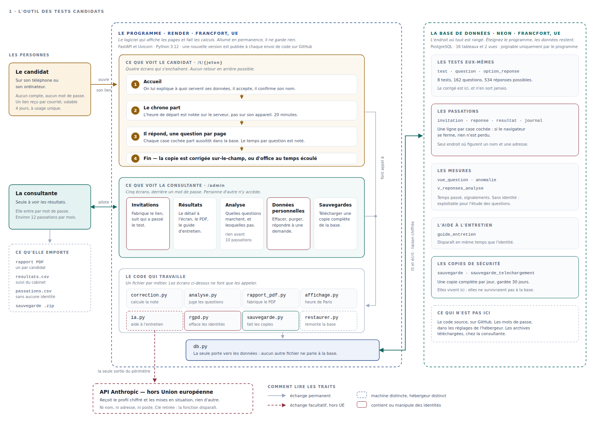
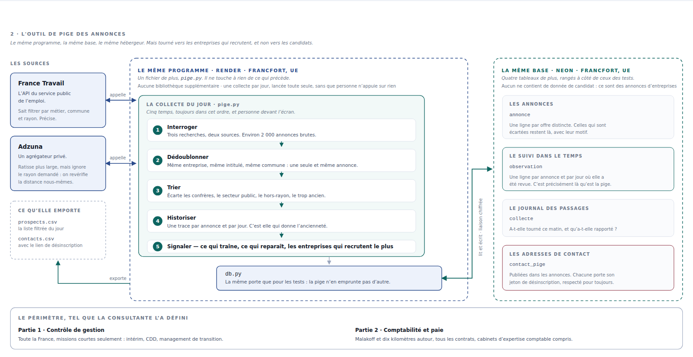
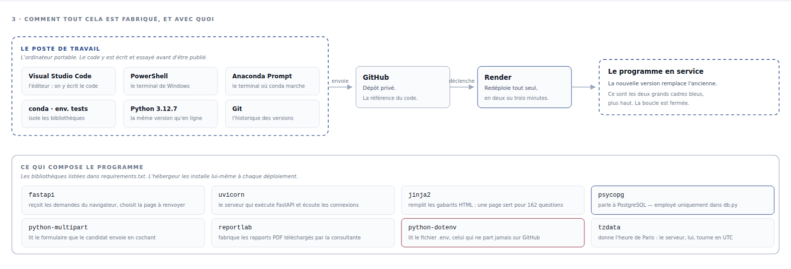

# Tests candidats et pige des annonces

Deux outils pour un cabinet de recrutement spécialisé en finance et en paie,
écrits pendant un stage de reconversion vers la donnée.

Le premier fait passer des tests à des candidats. Le second surveille les
offres d'emploi publiées et en tire une liste d'entreprises à démarcher.

Ils partagent le même programme, la même base de données et le même
hébergement. C'est un choix, expliqué plus bas.

**Application en service** — <https://tests-candidats.onrender.com>
Tout est en Python. Aucune autre technologie n'est nécessaire.

---

## Le problème de départ

Une consultante en recrutement recevait des candidatures en comptabilité et en
paie, et n'avait aucun moyen simple de vérifier les compétences annoncées
avant l'entretien. Elle faisait passer des tests sur papier, les corrigeait à
la main, et ne pouvait pas savoir si ses questions étaient bonnes.

En parallèle, elle repérait ses prospects en ouvrant chaque matin les sites
d'offres d'emploi. Une entreprise qui recrute un comptable est une entreprise
qui a un besoin — et une annonce qui traîne depuis six semaines est une
entreprise qui n'y arrive pas. C'est exactement le genre de signal qu'on ne
voit pas en regardant une liste une fois par jour, mais qu'on voit très bien
en gardant la trace de ce qu'on a vu hier.

Deux besoins différents, une même réponse : un programme qui tourne tout seul.

---

## Ce que ça fait

### Partie 1 — les tests candidats

La consultante crée une invitation depuis son back-office. Le programme
fabrique un lien unique, valable quelques jours, qu'elle envoie au candidat.
Celui-ci n'a ni compte ni mot de passe : le lien *est* son identification.

Il répond en vingt minutes, une question par page. Le chronomètre tourne côté
serveur, pas dans son navigateur — recharger la page ou changer de téléphone
ne rend pas une minute. Chaque case cochée part immédiatement en base, donc
une coupure de réseau ne coûte que la question en cours.

À la remise, la copie est corrigée toute seule et le candidat ne voit jamais
son résultat. La consultante, elle, reçoit le détail question par question,
un PDF à transmettre à son client, et si elle le demande un guide d'entretien.

Huit tests sont fournis : test technique et questionnaire de positionnement,
en comptabilité et en paie, niveaux junior et confirmé. Soit 162 questions et
534 réponses possibles.



### Partie 2 — la pige des annonces

Chaque matin, le programme interroge deux sources d'offres d'emploi —
l'API de France Travail et celle d'Adzuna — puis fait quatre choses.

Il **dédoublonne** : deux annonces qui portent la même entreprise, le même
intitulé et la même commune sont la même offre, quelle que soit la source.

Il **trie** : les cabinets de recrutement et les agences d'intérim sont des
confrères, pas des clients ; le secteur public passe par marché public ; une
annonce sans nom d'entreprise est inexploitable. Rien n'est supprimé pour
autant — une annonce écartée reste consultable avec son motif, parce qu'aucun
tri automatique n'est juste à tous les coups.

Il **historise** : une ligne par annonce et par jour. C'est le cœur de la
pige. Prise isolément, une collecte n'est qu'une photographie ; accumulées,
elles disent qu'une annonce dure depuis six semaines, ou qu'elle a disparu
puis reparu.

Il **signale** : les annonces les plus anciennes, les réapparitions, et les
entreprises qui ont le plus de postes ouverts.

Sur la première collecte complète, 2 066 annonces brutes ont donné
536 prospects exploitables.



---

## L'essayer en dix minutes

Il faut Python 3.12 et une base PostgreSQL. Le plus simple est un service
hébergé — [Neon](https://neon.tech) a une offre gratuite suffisante.
**Choisissez une région européenne** : les réponses des candidats sont des
données personnelles.

```bash
git clone https://github.com/BiraneWANE/Outil_Test_Pige_Cabinet_Rh.git
cd Outil_Test_Pige_Cabinet_Rh
pip install -r requirements.txt

cp .env.exemple .env      # puis remplissez DATABASE_URL et MOT_DE_PASSE_RECRUTEUR
python installer.py       # crée les 16 tables et charge les 8 tests
uvicorn main:app --reload
```

Puis <http://127.0.0.1:8000/admin>. L'identifiant est libre, le mot de passe
est celui du `.env`.

`installer.py` est sans danger : relancez-le autant de fois que vous voulez,
il ne détruit rien.

La pige a besoin de deux clés d'API supplémentaires, gratuites et obtenues en
un quart d'heure. Sans elles, la page s'ouvre et affiche un bandeau, le reste
fonctionne. Voir [docs/FONCTIONNEMENT_PIGE.md](docs/FONCTIONNEMENT_PIGE.md).

---

## Le mettre en ligne

L'application tourne sur [Render](https://render.com), plan Starter, région
Francfort. La base est chez Neon, région Francfort également.

Le déploiement est continu : un `git push` sur `main` déclenche une nouvelle
mise en ligne, en deux ou trois minutes. Aucune commande à lancer, aucun
serveur à administrer.

Les mots de passe et les clés ne sont **jamais** dans le dépôt. Ils vivent
dans le `.env` en local — que `.gitignore` exclut — et dans les variables
d'environnement de l'hébergeur en ligne.



---

## Ce que j'ai décidé, et pourquoi

Ce sont les six choix qui expliquent tout le reste du code.

**Le chronomètre appartient au serveur.** Confié au navigateur, il serait
modifiable en quelques clics par n'importe qui sachant ouvrir les outils de
développement. L'heure de départ est écrite en base au premier clic, et rien
de ce que fait le candidat ensuite ne la change.

**Rien n'attend la fin du test.** Enregistrer à la remise, c'est tout perdre
en cas de coupure. En écrivant chaque réponse aussitôt, l'incident ne coûte
qu'une question.

**Une seule porte vers les données.** Aucun fichier ne parle à la base sauf
`db.py`. C'est une contrainte que je me suis imposée au premier jour, et c'est
elle qui a rendu la pige possible en un fichier : `pige.py` a réutilisé la
même porte, sans rien changer à ce qui existait.

**Effacer n'est pas supprimer.** À 180 jours, l'identité du candidat
disparaît mais ses réponses restent. Elles ne désignent plus personne et
servent à repérer les questions mal formulées. La suppression totale reste
possible à tout moment sur demande.

**Écarter n'est pas jeter.** Une annonce mise de côté par la pige reste en
base avec son motif. Si un vrai prospect s'y trouve, il est rattrapable — ce
qui n'aurait pas été le cas s'il avait été supprimé.

**Deux sources d'annonces plutôt qu'une.** Elles ne se recouvrent presque
pas : 63 % des prospects venaient d'Adzuna seul, 37 % de France Travail seul,
moins de 1 % des deux. Se contenter de l'une aurait fait perdre un tiers du
gisement.

---

## Mesurer la qualité des questions

L'application ne se contente pas de corriger : elle mesure ses propres
questions à partir des passations réelles.

Pour chaque question, trois indicateurs — le taux de réussite, la corrélation
entre la réussite à cette question et le score global, et le temps médian.
Une question réussie par 98 % des candidats n'apporte aucune information. Une
question dont la corrélation est proche de zéro ne sépare pas les candidats
solides des autres : c'est la signature d'un énoncé ambigu. Une médiane de
trois secondes signale une question systématiquement expédiée.

Le seuil de fiabilité est fixé à trente passations. En dessous, l'interface le
dit franchement plutôt que d'afficher des chiffres qui ne veulent rien dire.

Le détail complet — signalements individuels, profils agrégés, export CSV —
est dans [docs/ANALYSE_DES_QUESTIONS.md](docs/ANALYSE_DES_QUESTIONS.md).

---

## Le guide d'entretien, et la ligne rouge

Une fonction facultative transforme un profil de positionnement en questions à
poser en entretien. Elle appelle un modèle de langage, et c'est le seul moment
où une donnée sort de l'Union européenne.

Le point important est ce qu'elle ne fait pas. Le modèle **ne produit aucune
évaluation du candidat** : il ne dit pas si le profil convient, ne recommande
rien, ne compare personne. Il reformule un profil déjà calculé en guide de
préparation.

Ce n'est pas un scrupule décoratif. Une évaluation automatisée de personne en
recrutement relève du RGPD sur les décisions automatisées et du règlement
européen sur l'IA, qui classe cet usage à haut risque. Un outil qui propose
des questions ne tombe pas dans ce champ — à condition de s'y tenir, et de
pouvoir le prouver.

Quatre garde-fous le garantissent : aucune donnée nominative n'est transmise,
le modèle reçoit l'interdiction explicite de juger, le texte produit est
vérifié avant enregistrement contre une liste de formulations interdites, et
le déclenchement est toujours manuel.

Sans clé d'API, la fonction est invisible et l'application fonctionne
normalement. Détail dans
[docs/GUIDE_ENTRETIEN_IA.md](docs/GUIDE_ENTRETIEN_IA.md).

---

## Les données personnelles

Le candidat est informé avant de démarrer et doit cocher une case. Son
acceptation est datée à la seconde.

Les identités sont effacées automatiquement au bout de 180 jours, par un
traitement qui tourne chaque jour sans que personne ait rien à lancer. Une
demande d'effacement anticipée se traite en un clic depuis le back-office.

Les annonces de la pige, elles, sont des données d'entreprise. Le seul cas
limite est l'adresse de contact publiée dans une offre : elle est encadrée,
chaque adresse porte son lien de désinscription, et une opposition vaut pour
toujours.

Le registre des traitements décrit les deux traitements en détail :
[docs/REGISTRE_TRAITEMENTS.md](docs/REGISTRE_TRAITEMENTS.md).

---

## Ne pas perdre la base

Une copie complète de la base est fabriquée chaque jour et conservée trente
jours. Elle rattrape une fausse manœuvre.

Mais une copie qui vit dans la base ne protège pas de la disparition de
l'hébergeur : elle disparaîtrait avec lui. C'est pourquoi le back-office
propose une archive à télécharger, et affiche un rappel au bout de sept jours
sans téléchargement.

L'archive est autonome : elle contient les données en JSON et en CSV, le
schéma SQL, et le script `restaurer.py` qui remet le tout dans une base vide.
Elle a été testée pour de vrai — dix tables restaurées à l'identique.

Détail dans
[docs/FONCTIONNEMENT_SAUVEGARDE.md](docs/FONCTIONNEMENT_SAUVEGARDE.md).

---

## Les fichiers

| Fichier | Ce qu'il fait |
|---|---|
| `main.py` | Les pages et les adresses. Il appelle, il ne calcule pas |
| `db.py` | La seule porte vers la base |
| `correction.py` | Calcule la note et le profil |
| `analyse.py` | Juge les questions, repère les signalements |
| `rapport_pdf.py` | Fabrique le PDF de résultat |
| `pige.py` | Collecte, dédoublonne, trie, historise les annonces |
| `sauvegarde.py` | Construit les archives |
| `restaurer.py` | Remet une archive dans une base vide |
| `rgpd.py` | Efface les identités arrivées à échéance |
| `ia.py` | Le guide d'entretien, avec ses garde-fous |
| `affichage.py` | L'heure de Paris — le serveur tourne en UTC |
| `installer.py` | Crée les tables et charge les questions |
| `charger_banque.py` | Recharge la banque de questions seule |
| `bilan_pige.py` | Un état des lieux de la pige, en lecture seule |

Les quatre fichiers `schema*.sql` décrivent les 16 tables et les 2 vues. Les
gabarits de pages sont dans `templates/`, la feuille de style dans `static/`.

`banque_questions.json` est la source unique des questions : on le modifie, on
relance `charger_banque.py`, et les tests sont à jour. Les passations déjà
faites gardent leurs résultats.

---

## Vérifier que tout marche

```bash
python test_correction.py    # la règle du tout ou rien, l'équilibre des profils
python test_analyse.py       # 60 passations simulées, dont 2 questions défectueuses
python test_ia.py            # 7 formulations interdites, l'absence d'identité
python test_sauvegarde.py    # la construction et la relecture d'une archive
python test_pige.py          # dédoublonnage, tri, périmètre
```

Aucun ne demande de réseau ni de base de données. `test_analyse.py` fabrique
soixante passations dont deux questions volontairement mauvaises, et vérifie
que l'analyse les repère sans accuser les questions saines.

---

## Ce qui reste à faire

Rien de bloquant, mais autant l'écrire.

La pige vient d'être mise en service : le compteur de réapparitions est
encore à zéro, il lui faut quelques semaines d'historique pour devenir utile.

Le code ROME du gestionnaire de paie n'est pas tranché — selon les annonces il
relève de la comptabilité ou de l'assistanat RH. Les deux sont interrogés,
avec un filtre sur l'intitulé.

Et surtout : à partir d'une cinquantaine de recrutements suivis dans le temps,
les données collectées permettraient de croiser le score obtenu avec la
réussite en poste, et donc de savoir si le test prédit réellement quelque
chose. Tant que ce recul n'existe pas, aucun modèle prédictif ne serait
honnête. Le schéma de la base est fait pour l'accueillir, pas pour le simuler.

---

*Birane Wane — projet de stage, 2026.*
